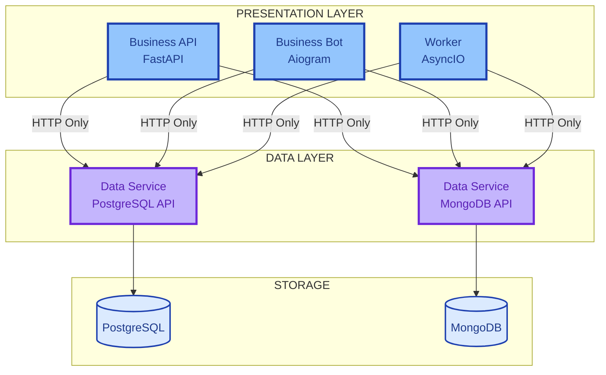

# AI Generator for Async Microservices

<div align="center">

**One Architecture to Rule Them All**

Build production-ready async microservices with battle-tested patterns.
No more chaos. No more inconsistency. Just working code.

[Get Started](getting-started/quick-start.md){ .md-button .md-button--primary }
[View on GitHub](https://github.com/bgs2509/ai-generator-asyncmicroservices){ .md-button }

</div>

---

## The Problem: Three Projects, Three Rings of Chaos 🌋

Ask AI to generate code for three projects. Get three different kingdoms:

- **Project A**: `user_service` + direct DB + `print()` debugging (it's 2025, not 2015!)
- **Project B**: `userService` + HTTP APIs + DB access (wait, both?!) + `OhNoSomethingWentWrongException`
- **Project C**: `user-svc_v2_FINAL` + mystery data layer + `try/except: pass` (courage of closing eyes)

You're not a developer. You're an archaeologist hunting "that RabbitMQ config."

**Different projects. Different planets. Different despair.**

---

## The Solution: One Ring to Rule Them All 💍

**AI Generator for Async Microservices** — your architectural One Ring. One pattern. One truth.

```
┌──────────────────────────────────────────┐
│  💍 One Ring — Every Project            │
├──────────────────────────────────────────┤
│  Structure:  Business API, Data API,     │
│              Workers, Bots               │
│                                          │
│  Naming:     {context}_{domain}_{type}   │
│              finance_lending_api ✅      │
│              No user-svc_v2_FINAL 🚫     │
│                                          │
│  Patterns:   HTTP-only data access       │
│              Async-first                 │
│              Type-safe (mypy strict)     │
│                                          │
│  Stack:      FastAPI, PostgreSQL, Redis  │
│              RabbitMQ, Docker, Nginx     │
│              Prometheus, Grafana, Jaeger │
└──────────────────────────────────────────┘
```

**The magic?** AI doesn't reinvent. AI **copies** battle-tested infrastructure, generates your unique business logic.

- Infrastructure (Docker, Nginx, CI/CD)? **Copy.** ✅
- Logging, health checks, graceful shutdown? **Copy.** ✅
- Your `LoanApplication`, `TelemedicineSession`? **AI generates.** 🤖

Open Project A Monday. Navigate blindfolded.
Switch to Project B Tuesday. Same structure. Same joy.
Deploy Project C Friday. You already know every file.

**One standard. Every project. Your sanity preserved.**

---

## ✨ Key Features

<div class="grid cards" markdown>

-   :material-book-open-variant:{ .lg .middle } **Atomic Documentation**

    ---

    135+ modular docs covering architecture, services, infrastructure, observability, testing, security

    [:octicons-arrow-right-24: Explore docs](reference/project-structure.md)

-   :material-code-braces:{ .lg .middle } **Service Templates**

    ---

    FastAPI Business API, Telegram Bots, Workers, PostgreSQL/MongoDB Data APIs

    [:octicons-arrow-right-24: View templates](templates/README.md)

-   :material-docker:{ .lg .middle } **Production Infrastructure**

    ---

    Docker, Nginx, CI/CD, Prometheus, Grafana, Jaeger, ELK stack ready to deploy

    [:octicons-arrow-right-24: Infrastructure guide](guides/architecture-guide.md)

-   :material-robot:{ .lg .middle } **7-Stage AI Workflow**

    ---

    Validation → Requirements → Planning → Generation → Verification → Handoff

    [:octicons-arrow-right-24: AI workflow](guides/ai-code-generation-master-workflow.md)

-   :material-speedometer:{ .lg .middle } **Maturity Levels**

    ---

    PoC (~5 min) to Production (~30 min) with incremental complexity

    [:octicons-arrow-right-24: Maturity levels](reference/maturity-levels.md)

-   :material-check-circle:{ .lg .middle } **Quality Built-in**

    ---

    Type hints, tests, linting, mypy strict mode from day one

    [:octicons-arrow-right-24: Quality standards](CONTRIBUTING.md)

</div>

---

## 🚀 Quick Start

### Prerequisites

- **Python** 3.12+
- **Docker** 24.0+
- **Docker Compose** 2.20+
- **Git** 2.40+

### Setup in 30 Seconds

```bash
# Create your project and add framework
mkdir my_awesome_project && cd my_awesome_project && git init
git submodule add https://github.com/bgs2509/ai-generator-asyncmicroservices .ai-framework
git submodule update --init --recursive
```

**That's it!** 🎉

**Next:** Point your AI agent to `.ai-framework/AGENTS.md` — it will read the knowledge base and generate code in your project.

---

## 🏗️ Architecture

### Improved Hybrid Approach

The framework implements a **strict service separation model**:



### Core Principles

1. **HTTP-Only Data Access** — Business services NEVER access databases directly
2. **Single Event Loop Ownership** — Each service owns its event loop (no sharing)
3. **DDD & Hexagonal Architecture** — Clear domain boundaries and ports/adapters
4. **Async-First** — All I/O operations use async/await
5. **Type Safety** — Full type hints, mypy strict mode compatible
6. **Observability by Design** — Structured logging, metrics, tracing built-in

---

## 📚 Technology Stack

| Category | Technologies |
|----------|-------------|
| **Core** | Python 3.12+, FastAPI 0.115+, Aiogram 3.13+, Pydantic, AsyncIO |
| **Data** | PostgreSQL 16+, MongoDB 7+, Redis 7+, SQLAlchemy 2.0+, Alembic |
| **Infrastructure** | Docker 24+, Nginx 1.27+, RabbitMQ 3.13+, Docker Compose 2.20+ |
| **Observability** | Prometheus, Grafana, Jaeger, ELK Stack, Sentry |
| **Quality** | pytest 8.3+, mypy 1.11+, Ruff 0.6+, Testcontainers |
| **CI/CD** | GitHub Actions, Makefile |

---

## 🎯 What's Next?

<div class="grid cards" markdown>

-   :material-rocket-launch:{ .lg .middle } **[Quick Start Guide](getting-started/quick-start.md)**

    Learn how to set up your first project in minutes

-   :material-book-education:{ .lg .middle } **[Architecture Guide](guides/architecture-guide.md)**

    Deep dive into the framework's architecture and design patterns

-   :material-code-tags:{ .lg .middle } **[Service Templates](templates/README.md)**

    Explore pre-built templates for different service types

-   :material-lightbulb-on:{ .lg .middle } **[Examples](EXAMPLES.md)**

    See real-world examples of projects built with the framework

</div>

---

**Made with ❤️ for developers who value consistency, quality, and automation.**

**Version**: 0.1.0 • **Status**: Active Development • **Updated**: 2025-01-05
